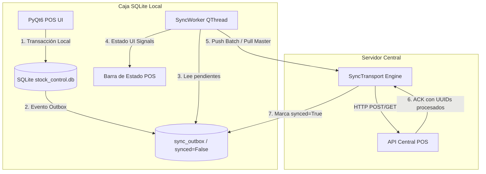

# SPEC-006: Sincronización Offline-First con Patrón Outbox y SyncWorker

## 1. Visión General y Objetivos
Implementar una arquitectura de sincronización robusta, asíncrona y resiliente bajo la filosofía **Offline-First** para terminales POS en la Triple Frontera. El sistema debe permitir que cada caja opere 100% de manera autónoma contra su base de datos local SQLite (`stock_control.db`), sincronizando en segundo plano ventas, cobros, arqueos y catálogo de productos hacia y desde el servidor central / nube.

### Objetivos Principales:
1. **Operatividad Ininterrumpida (Zero-Downtime)**: La terminal POS nunca bloquea el cobro, la emisión de tickets ni la atención al cliente si se pierde la conexión a la red local o a internet.
2. **Patrón Outbox Idempotente**: Registro transaccional seguro de eventos en `sync_outbox` con UUID universal (`uuid4`), garantizando entrega exacta (*At-Least-Once Delivery* con desduplicación por UUID).
3. **Sincronización Bidireccional Asíncrona (`SyncWorker` en `QThread`)**:
   - **Push (Terminal -> Servidor)**: `invoices`, `invoice_items`, `payments`, `cash_movements`, `cash_audits`, `stock_adjustments`.
   - **Pull (Servidor -> Terminal)**: Nuevos productos, precios actualizados, códigos de barra, cotizaciones de divisas (`currency_rates`).
4. **Manejo Inteligente de Red y Reintentos**:
   - Algoritmo de *Backoff Exponencial con Jitter* (1s, 2s, 4s, 8s... hasta max 60s) en caso de fallos de red.
   - Timeout estricto de conexión (< 3.0s) para no consumir recursos innecesarios.
   - Lotes optimizados (*Batching*) de hasta 50 registros por ciclo.
5. **Feedback Visual en Tiempo Real para el Cajero**:
   - Widget de estado en la barra inferior del POS (🟢 Conectado / Sincronizado, 🟡 Sincronizando X pendientes, 🔴 Modo Offline).
   - Opción de sincronización manual forzada.
6. **Transporte Desacoplado**:
   - `HttpSyncTransport`: Conector HTTP/HTTPS REST con compresión gzip y headers de autenticación de sucursal/caja.
   - `MockSyncTransport`: Simulador para testing integral automatizado, simulación de cortes de red y validación sin dependencias externas.

---

## 2. Diagrama de Flujo y Arquitectura

---

## 3. Modelo de Datos y Entidades

### 3.1 Estructura del Outbox (`sync_outbox`)
- `id`: Entero autoincremental local.
- `entity_name`: Nombre de la tabla (`invoices`, `payments`, `cash_audits`, etc.).
- `entity_uuid`: Identificador universal RFC-4122 (36 caracteres).
- `action`: Acción (`INSERT`, `UPDATE`, `DELETE`).
- `payload_json`: Carga útil serializada en JSON con precisión `decimal.Decimal` formateada.
- `created_at`: Fecha y hora UTC del registro.
- `synced`: Booleano (False = Pendiente, True = Sincronizado).
- `retry_count`: Número de reintentos fallidos.
- `last_error`: Mensaje del último error registrado.

---

## 4. Matriz de Resolución de Conflictos

| Tipo de Entidad | Dirección | Estrategia de Resolución | Racional Técnico |
| :--- | :---: | :--- | :--- |
| **Ventas y Detalles** (`invoices`, `invoice_items`) | Push | *Append-Only* / Idempotente por `uuid` | Las ventas locales son hechos históricos fiscales inmutables. |
| **Pagos y Vouchers** (`payments`) | Push | *Append-Only* / Idempotente por `uuid` | Vinculados a comprobantes de autorización y tickets POS. |
| **Arqueos y Cierres** (`cash_audits`, `cash_sessions`) | Push | *Append-Only* | Auditorías de caja asociadas al turno local. |
| **Catálogo de Productos** (`products`, `barcodes`) | Pull | *Server-Wins* (Última actualización) | La administración central gobierna precios y altas de productos. |
| **Cotizaciones de Monedas** (`currency_rates`) | Pull | *Append-Only* inmutable | El servidor emite las tasas del día; la caja las adopta inmediatamente. |

---

## 5. Reglas de Validación y Estándar de Tipos
- **Cero `float`**: Todos los montos en JSON deben serializarse y deserializarse como `str` numérico y convertirse a `decimal.Decimal`.
- **Integridad Transaccional**: El guardado de la venta en SQLite y la inserción en `sync_outbox` deben realizarse en la misma transacción atómica de SQLAlchemy.
- **Resguardo de Datos**: Bajo ningún concepto se elimina un registro local no sincronizado.
