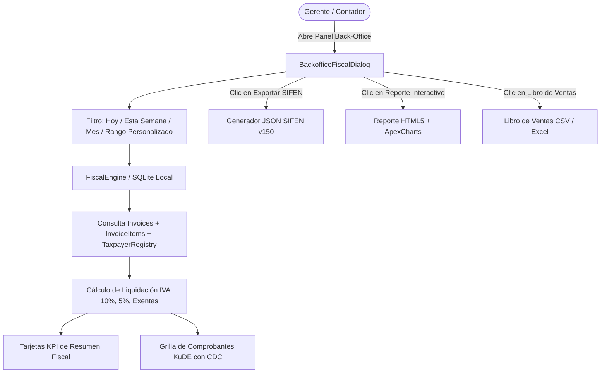

# SPEC-008: Panel de Back-Office Fiscal, Dashboard IVA y Generador JSON SIFEN

## 1. Visión General y Objetivos
Proporcionar un módulo integral de administración, auditoría fiscal y reportes contables para el POS Supermercado Triple Frontera. Permite a la gerencia y al área contable visualizar en tiempo real la liquidación de IVA (10%, 5% y Exentas), rastrear comprobantes fiscales electrónicos (KuDE con CDC de 44 dígitos) y generar libros de ventas y lotes JSON compatibles con el estándar de Facturación Electrónica Nacional (SIFEN / DNIT v150).

### Objetivos Principales:
1. **Liquidación Fiscal en Tiempo Real**:
   - Desglose contable automático de Ventas Gravadas 10% (IVA = `total / 11`), 5% (IVA = `total / 21`) y Exentas (`IVA = 0`).
   - Todos los cálculos monetarios procesados estrictamente con `decimal.Decimal` (0 `float`).
2. **Monitor y Trazabilidad KuDE**:
   - Visualización de comprobantes emitidos en el período seleccionado.
   - Búsqueda y filtrado por rango de fechas, RUC, cliente, número de factura y CDC (Código Digital de Control de 44 dígitos).
3. **Generador de Lotes JSON para SIFEN / e-Kuatia (v150)**:
   - Exportación de las facturas electrónicas a formato JSON estructurado con datos del emisor, receptor, ítems con tasas de IVA discriminadas y totales de liquidación impositiva.
4. **Dashboard Ejecutivo y Reportes**:
   - Tarjetas KPI de resumen (Total Facturado, Base Imponible, Total IVA 10%, Total IVA 5%, Total Exentas).
   - Generador de reportes HTML5 interactivos con **ApexCharts** y exportador a formato CSV / Libro de Ventas.

---

## 2. Diagrama de Flujo



---

## 3. Estructura JSON SIFEN v150

El generador debe emitir un JSON compatible con la estructura:
```json
{
  "version": "150",
  "emisor": {
    "ruc": "80089552",
    "dv": "1",
    "razon_social": "SUPERMERCADO TRIFRONTERA S.A.",
    "timbrado": "12345678",
    "establecimiento": "001",
    "punto_emision": "001"
  },
  "periodo": {
    "desde": "2026-10-01",
    "hasta": "2026-10-01"
  },
  "resumen_impuestos": {
    "total_gravado_10": "909091",
    "total_iva_10": "90909",
    "total_gravado_5": "0",
    "total_iva_5": "0",
    "total_exentas": "0",
    "total_iva": "90909",
    "total_general": "1000000"
  },
  "documentos": [ ... ]
}
```

---

## 4. Requerimientos de Precisión Numérica
- Los montos acumulados y bases imponibles deben cuantizarse en `Decimal('1')` para Guaraníes (`PYG`).
- El cálculo de IVA debe validar la regla: `total_general == total_gravado_10 + total_iva_10 + total_gravado_5 + total_iva_5 + total_exentas`.
